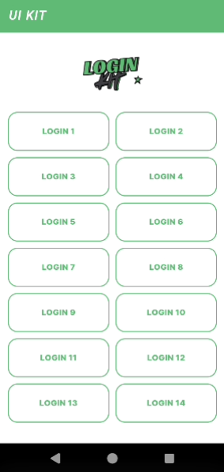
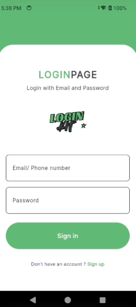
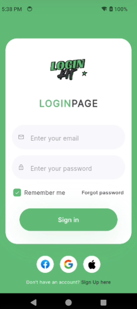
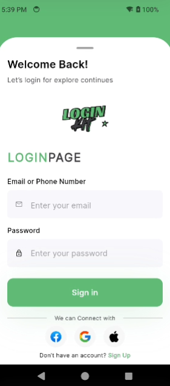
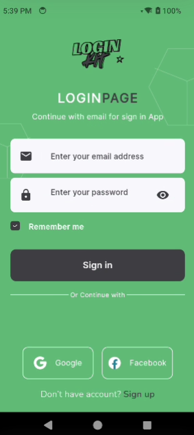
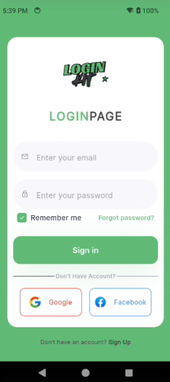

# Login kit Flutter 
 Flutter Login Kit

## App Screenshots

Below are the app screenshots showcasing different Login Ui Design:

<table>
  <tr>
    <td></td>
    <td></td>
    <td></td>
  </tr>
  <tr>
    <td></td>
    <td></td>
    <td></td>
    </tr>
</table>